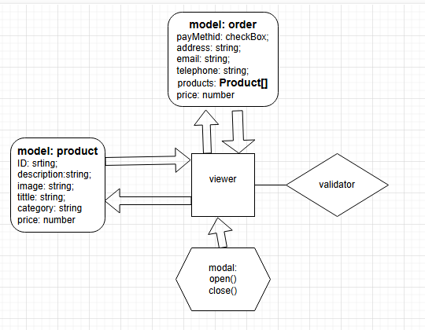

# Проектная работа "Веб-ларек"

Стек: HTML, SCSS, TS, Webpack

Структура проекта:
- src/ — исходные файлы проекта
- src/components/ — папка с JS компонентами
- src/components/base/ — папка с базовым кодом


## Архитектура проекта

Код приложения разделен на слои согласно парадигме MVP:

- отображение - отображение данных на странице.
- данные - хранение и изменение данных
- взаимодействия - презентер - отображение и данные.

## Базовый код

### class Api:
- [api.ts](src/components/base/api.ts)
- `constructor(baseUrl: string, options: RequestInit = {})`- принимает базовый URL и глобальные опции для всех запросов(опционально).
- методы запроса на сервер: 'GET'|'POST' | 'PUT' | 'DELETE'
- Методы класса:
- - `get` запрос на получение одного или всех продуктов `(enpoint)`
- - `post` отправляет на сервер информацию о пользователе, общую цену и список товаров `(enpoint, data)`

### class EventEmitter
- [events.ts](src/components/base/events.ts)
- конструктор создаёт словарь, ключ имя события и значение множество его обработчиков
- Брокер событий, классическая реализация
  * ```on``` Установить обработчик на событие `(eventName, callback)` 
  * ```off``` Снять обработчик с события `(eventName, callback)`
  * ```emit``` Инициировать событие с данными `(eventName, data)`
  * ```onAll``` Слушать все события `(event)`
  * ```offAll``` Сбросить все обработчики `без параметров`
  * ```trigger``` Сделать коллбек триггер, генерирующий событие при вызове `(eventName, context)`

### Данные

**ЗАКАЗ:**
- класс заказа, количество товаров и общая цена.
- инициирует
- - пустой список для товаров
- - общая цена по умолчанию 0
- метод ```addProduct``` добавляет в заказ продукт `(idProduct)`
- метод ```deleteProduct``` удаляет из заказа продукт `(idProduct)`
```
interface IOrder {
    products: IProductItem[];
    totalPrice: number;
    addProduct(id: string): void;
    deleteProduct(id: string): void;
}
```

**Данные ПОЛЬЗОВАТЕЛЯ:**
Класс для хранения информации от пользователя.
- ```payment``` способ оплаты
- ```address``` адрес доставки
- ```email``` емайл
- ```telephone``` телефон для связи
#### Методы ```set``` для установки значений

```
IUserData {
    payment: paymentMethod;
    address: string;
    email: string;
    telephone: string;
    setPayment(payment: string): void;
    setAddress(address: string): void;
    setEmail(email: string): void;
    setTelephone(telephone: string): void;
}
```

**ПРОДУКТ:**
класс продуктов, будет выгружаться с сервера и заполняться страница или модальное окно
```
IProductItem {
    "id": string,  // Уникальный номер торвара
    "description": string, // описание торвара
    "image": string, // Ссылка на картинку торвара
    "title": string, // Название торвара
    "category": string, // Категория товара
    "price": number // Цена товара
}
```

## Взаимодействие 
1. При загрузке страницы выгружается список товаров
2. Пользователь выбирает товары, добавляю их в корзину
3. При оформлении заказа указывает контактную информацию и способ оплаты
4. оформляет заказ

# процессы в приложении
#### реализованы с использованием событий и брокера событий (EventEmitter). Это позволяет компонентам приложения взаимодействовать друг с другом через события, что делает архитектуру более гибкой и модульной. API-клиент (Api class) отвечает за взаимодействие с сервером, а модели данных (IOrder, IUserData, IProductItem) хранят и управляют данными. Модальные окна (IModal) отвечают за отображение модальных окон.

## Типы:

**Модульные окна:**
Класс модального окна
получает информаций о типе модального окна (о товаре, форма для заполнении или заказ)
метод ```open``` открывает модальное окно
метод ```close``` закрывает модальное окно

```
export interface IModal {
    "modal": string;
    open(<T>): void;
    close(): void;
}
```

**Слой отображения:**
общий абстрактный класс:
```
interface IView<T> {
    render(): void;
    update(): void;
    clear(): void;
}
```
от него наследуются главной страницы, корзины, отдельного продукта и окон для заказа
 

Важные файлы:
- src/pages/index.html — HTML-файл главной страницы
- src/types/index.ts — файл с типами
- src/index.ts — точка входа приложения
- src/scss/styles.scss — корневой файл стилей
- src/utils/constants.ts — файл с константами
- src/utils/utils.ts — файл с утилитами

## Установка и запуск
Для установки и запуска проекта необходимо выполнить команды

```
npm install
npm run start
```

или

```
yarn
yarn start
```
## Сборка

```
npm run build
```

или

```
yarn build
```


## схема:

